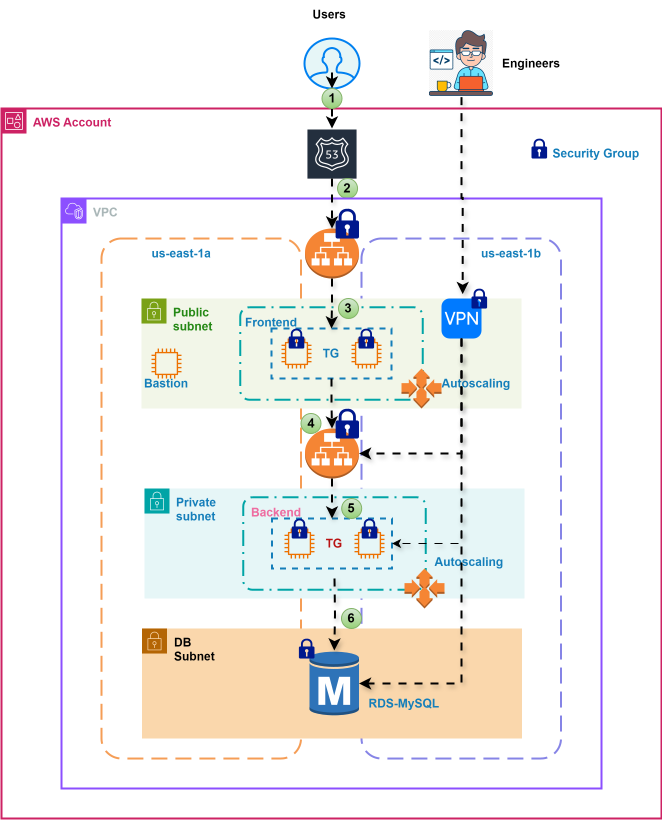

# Expense Architecture



# Important: 
->We usually use either bastion or VPN server for application. Here we use VPN Server only.
# We didn't use or create bastion server for application.
->We use VPN server to connect db, backend and frontend servers. Once vpn is open, first we connect db using VPN IP, we directly access backend and frontend servers using its private IP address and do troubleshoot.

Trouble shoot:
# DB: 
We can access db or mysql server using VPN even it is in private subnet.
VPN server created using ubuntu server.
mysql troubleshoot commands:
openvpnas@openvpnas3:~$ sudo apt update
openvpnas@openvpnas3:~$ sudo apt install mysql-client -y
openvpnas@openvpnas3:~$ mysql -h expense-dev.c0d4soae2u8h.us-east-1.rds.amazonaws.com -u root -pExpenseApp1
openvpnas@openvpnas3:~$ telnet backend 8080


# Backend:
 The backend server is in private subnet, but we can access its using private ip address and troubleshoot backend server through vpn means vpn already open.
backend private IP$mysql -h db-dev.lithesh.shop  -uroot -pExpenseApp1
show databases;
use transactions;
select * from transactions;

* backend troubleshoot commands:
backend private IP$systemctl status backend
backend private IP$netstat -lntp
backend private IP$ps -ef  | grep node
backend private IP$telnet web-dev.lithesh.shop 80

# Frontend: 
The frontend server is in public subnet, but we can access its using private ip address and troubleshoot backend server through vpn means vpn already open.
* frontend troubleshoot commands:
frontend private IP$systemctl status frontend
frontend private IP$netstat -lntp
frontend private IP$ps -ef  | grep node


# Internet
#    ↓
# Web ALB (80/443)
#    ↓
# Frontend (80)
#    ↓
# App ALB (80)
#    ↓
# Backend (8080)
#    ↓
# DB (3306)


# db_backend_3306
# backend_app_alb_8080
# app_alb_frontend_80
# frontend_web_alb_80
# web_alb_public_80
# web_alb_public_443


```
for i in 01-vpc/ 02-sg/ 04-db/ 05-vpn/ 06-app-alb/ 08-acm/ 09-web-alb/ 11-cdn/ ; do cd $i; terraform init ; cd .. ; done 
```

```
for i in 01-vpc/ 02-sg/ 04-db/ 05-vpn/ 06-app-alb/ 08-acm/ 09-web-alb/ 11-cdn/ ; do cd $i; terraform plan; cd .. ; done 
```
```
for i in 01-vpc/ 02-sg/ 04-db/ 05-vpn/ ; do cd $i; terraform apply -auto-approve; cd .. ; done 
```
```
ssh -i ~/.ssh/openvpn openvpnas@32.192.36.

```

```
for i in  06-app-alb/ 08-acm/ 09-web-alb/ 11-cdn/ ; do cd $i; terraform apply -auto-approve; cd .. ; done 
```
```
for i in 01-vpc/ 02-sg/ 03-bastion/ 04-db/ 05-vpn/ 06-app-alb/ 07-backend/ 08-acm/ 09-web-alb/ 10-frontend/ 11-cdn/ ; do cd $i; terraform apply -auto-approve; cd .. ; done 
```

```
for i in  11-cdn/ 09-web-alb/ 08-acm/ 06-app-alb/ 05-vpn/ 04-db/ 02-sg/ 01-vpc/ ; do cd $i; terraform destroy -auto-approve; cd .. ; done 
```


Note: We can use either default VPC subnet and its security group or roboshop VPC subnet or its security group.

#  default VPC subnet and its security group
    vpc_security_group_ids = [data.aws_ssm_parameter.bastion_sg_id.value]
    subnet_id              = data.aws_subnet.selected.id

# roboshop VPC subnet or its security group
    vpc_security_group_ids = [data.aws_ssm_parameter.mongodb_sg_id.value]
    subnet_id              = local.database_subnet_id
